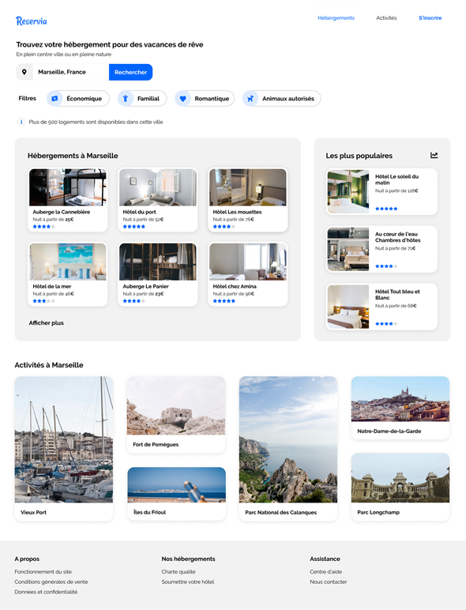

# Transformez une maquette en site web : Reservia
### *Projet formation développeur web*
- Réaliser depuis une maquette desktop et une maquette mobile, l'intégration du site web.
- Bibliothèque d'icônes : [Font Awesome](https://fontawesome.com/)
- Charte graphique : *bleu* #0065FC, *version plus claire du bleu* #DEEBFF, *gris pour le fond* #F2F2F2.
- Police d'écriture : [Raleway](https://fonts.google.com/specimen/Raleway)
- Maquette desktop : 
- Maquette mobile : 